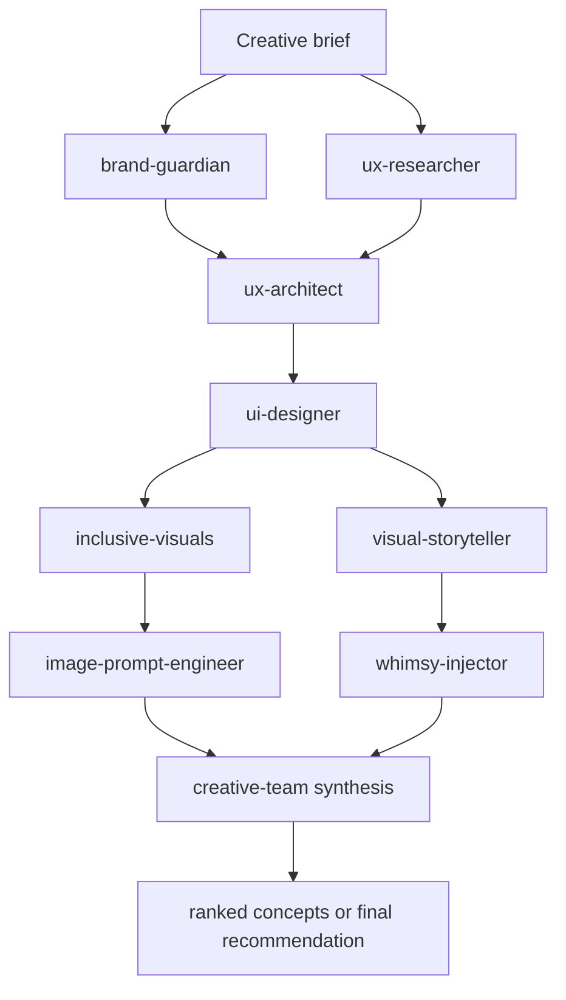

# Creative Team

<p align="center">
  <strong>Multi-skill creative operating system for Codex</strong><br>
  Brand, UX, UI, storytelling, inclusion, and prompt craft coordinated as one team.
</p>

---

## What This Repo Is

`creative-team` is a portable skill bundle that packages one orchestrator skill plus eight specialized subskills:

- brand strategy and identity
- UX research and validation
- UX architecture and information flow
- UI system design
- visual storytelling
- deliberate delight and microcopy
- inclusive visual prompting
- precise image prompt engineering

The goal is simple: take a creative brief, route it through the right specialists in parallel, and return one decisive recommendation that is mobile-safe, visually strong, and performance-aware.

## Included Skills

| Skill | Purpose |
|---|---|
| `creative-team` | Orchestrates the full team, resolves conflicts, and synthesizes the final recommendation |
| `brand-guardian` | Positioning, tone, identity coherence, and brand protection |
| `ux-researcher` | User intent, evidence, validation, and recommendation support |
| `ux-architect` | Information architecture, hierarchy, flows, and structure |
| `ui-designer` | Responsive UI systems, tokens, states, and implementation-ready specs |
| `visual-storyteller` | Narrative direction, story arcs, motion, and visual sequencing |
| `whimsy-injector` | Tasteful delight, personality, and microcopy that still respects usability |
| `inclusive-visuals` | Bias-aware, culturally accurate visual prompting and review |
| `image-prompt-engineer` | High-precision prompts, variants, and control for image generation |

## Orchestration Model



## Hero Sprint Pattern

When the request is about a hero section or landing page:

1. `brand-guardian` defines the promise and tone.
2. `ux-researcher` defines the real user intent.
3. `ux-architect` defines the hierarchy and CTA order.
4. `ui-designer` defines layout, responsive behavior, and states.
5. `visual-storyteller` defines the emotional arc and motion language.
6. `inclusive-visuals` checks representation, realism, and safety.
7. `image-prompt-engineer` generates support frames or posters.
8. `whimsy-injector` adds only the delight that improves the product.
9. `creative-team` synthesizes the final answer.

## Repository Layout

```text
.
├── README.md
├── creative-team/
├── brand-guardian/
├── ux-researcher/
├── ux-architect/
├── ui-designer/
├── visual-storyteller/
├── whimsy-injector/
├── inclusive-visuals/
└── image-prompt-engineer/
```

Each skill folder is self-contained:

- `SKILL.md` contains the runtime instructions.
- `agents/openai.yaml` contains UI metadata.
- `references/` holds deeper orchestration or domain notes when needed.

## How To Use

### Full creative sprint

Use `creative-team` when you need a coordinated answer across brand, UX, UI, and visuals.

### Single-specialist work

Use the subskills directly when the problem is narrow:

- `brand-guardian` for identity or messaging
- `ux-researcher` for evidence and validation
- `ux-architect` for flows and structure
- `ui-designer` for interface specs
- `visual-storyteller` for narrative framing
- `inclusive-visuals` for representation-sensitive prompts
- `image-prompt-engineer` for prompt precision
- `whimsy-injector` for delight and personality

## Quality Rules

- Mobile legibility wins over decorative complexity.
- Accessibility is part of the design, not a follow-up.
- Performance cost is a first-class constraint.
- Parallel work should stay independent until synthesis.
- The final answer should be decisive, not a menu of vague possibilities.

## Version

- `creative-team-bundle v0.1.0`
- Initial release with orchestrator + eight subskills
